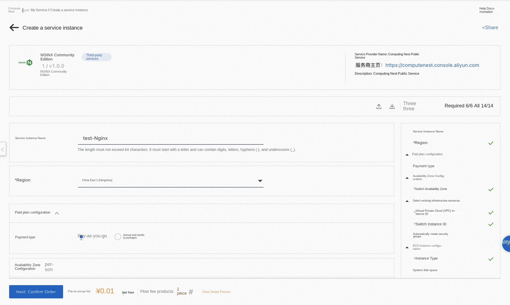
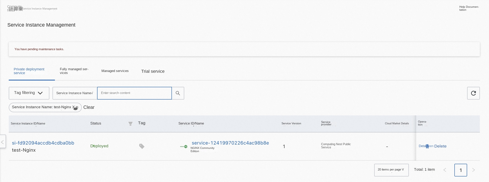
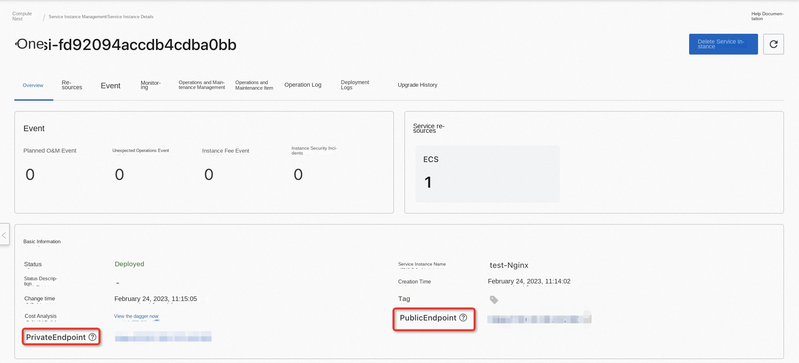

# Nginx Community Edition Service Instance Deployment Document
## Overview
Nginx is a high performance HTTP and reverse proxy server. Nginx provides a community version of the service on the computing nest. You can quickly deploy Nginx services on the computing nest and implement O & M monitoring without configuring your own cloud host, so that you can easily build your own applications based on Nginx. This article describes how to activate the Nginx community edition service on the computing nest, as well as the deployment process and usage instructions.
## Billing Description
The cost of Nginx Community Edition on computing nest mainly involves:

-Selected vCPU and memory specifications
-System disk capacity
-Public network bandwidth

Billing methods include:

-Pay-as-you-go (hourly)
-Annual and monthly packages

The estimated cost is displayed in real time when you create an instance.

## Deployment Architecture
Nginx Community Edition uses a stand-alone deployment architecture.

## Required Permissions for RAM Users
The Nginx service needs to access and create resources such as ECS and VPC. If you use a RAM user to create a service instance, you need to add the corresponding resource permissions to the account of the RAM user before creating the service instance. For detailed instructions on adding RAM permissions, see [Grant Permissions to RAM Users](https://help.aliyun.com/document_detail/121945.html). The required permissions are shown in the table below.

| Permission policy name | Comment |
| --- | --- |
| AliyunECSFullAccess | Permissions to manage ECS instances |
| AliyunVPCFullAccess | Permissions to manage a VPC |
| AliyunROSFullAccess | Manage permissions for Resource Orchestration Service (ROS) |
| AliyunComputeNestUserFullAccess | Manage user-side permissions for the compute nest service (ComputeNest) |
| AliyunCloudMonitorFullAccess | Permissions to manage CloudMonitor |

## Deployment process
### Deployment Steps
Click [Deployment Link](https://computenest.console.aliyun.com/user/cn-hangzhou/serviceInstanceCreate?ServiceId=service-393b398bccc1459e93fc) to enter the service instance deployment page, and fill in the parameters according to the interface prompts to complete the deployment.

### Deployment Parameter Description
During the process of creating a service instance, you need to configure the service instance information. The following section describes the input parameters of the Nginx Community Edition service instance.

| Parameter Group | Parameter Item | Example | Description |
| --- | -------- | --- | --- |
| Service Instance Name | | test | The name of the instance |
| Region | | China East 1 (Hangzhou) | The region of the selected service instance. We recommend choosing the region closest to you for lower network latency. |
| Availability Zone Configuration | Deployment Region | Availability Zone I | Different availability zones within a region |
| Payment Type Configuration | Payment Type | Pay-As-You-Go or Subscription |
| Select Existing Infrastructure Configuration | VPC ID | vpc-xxx | Select the ID of the VPC. |
| Select Existing Infrastructure Resources | VSwitch ID | vsw-xxx | Select a VSwitch ID. If the switch cannot be found, try switching the region and availability zone.
| ECS instance configuration | Instance type | ecs.g7.large | Instance type, which can be selected according to actual needs |
| ECS Instance Configuration | System Disk Space | 40 | System disk space can be selected based on actual requirements |
| ECS Instance Configuration | Instance Password | ******** | Set the instance password. The password must be 8 to 30 characters long and include at least three of the following: uppercase letters, lowercase letters, numbers, and special characters from the set: ()'~!@#$%^&*-+={}[]:;'<>,.?/. |
| ECS instance configuration | Enable public IP address | True | Whether to enable public IP address |

### Verification Results

1. View the service instance.
After the service instance is created, the deployment will take approximately 2 minutes. After deployment is complete, you can see the corresponding service instances on the page.

2. Access Nginx through the service instance.

After entering the corresponding service instance, you can get the PublicEndpoint and PrivateEndpoint on the page.

### Using Nginx
Please visit the Nginx website to learn how to use Nginx:[Nginx usage document](https://docs.nginx.com/)
