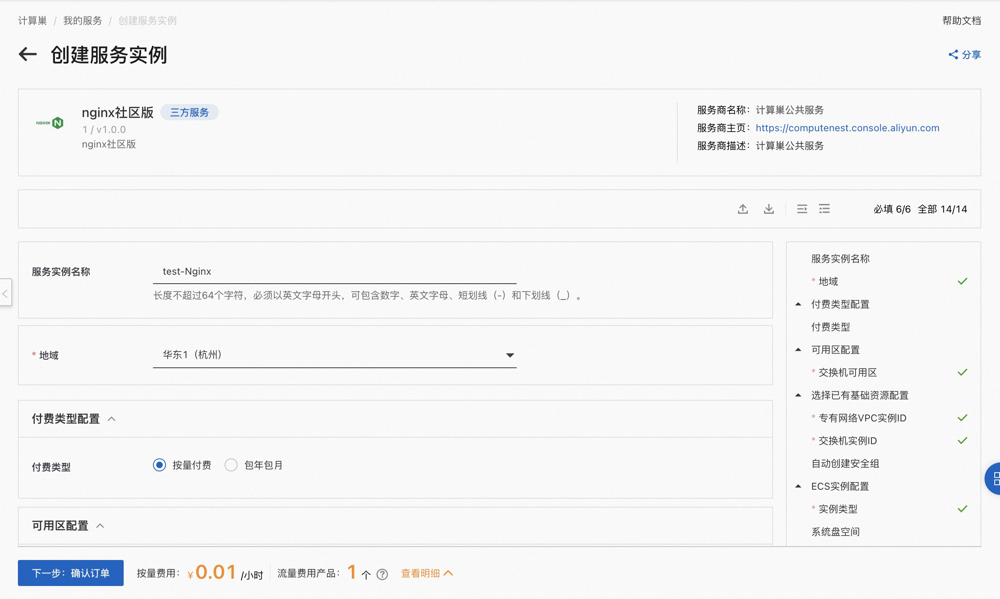
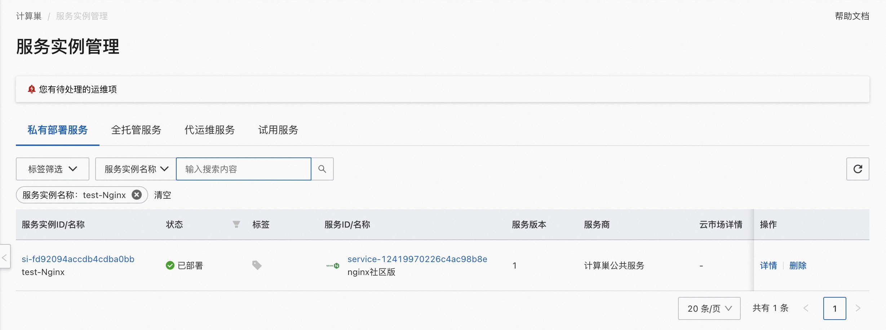

# Nginx社区版服务实例部署文档
## 概述
Nginx是一个高性能的HTTP和反向代理服务器。Nginx在计算巢上提供了社区版服务，您无需自行配置云主机，即可在计算巢上快速部署Nginx服务、实现运维监控，从而方便地基于Nginx搭建您自己的应用。本文向您介绍如何开通计算巢上的Nginx社区版服务，以及部署流程和使用说明。
## 计费说明
Nginx社区版在计算巢上的费用主要涉及：

- 所选vCPU与内存规格
- 系统盘容量
- 公网带宽

计费方式包括：

- 按量付费（小时）
- 包年包月

预估费用在创建实例时可实时看到。
## 
## 部署架构
Nginx社区版采用单机部署的架构。

## RAM账号所需权限
Nginx服务需要对ECS、VPC等资源进行访问和创建操作，若您使用RAM用户创建服务实例，需要在创建服务实例前，对使用的RAM用户的账号添加相应资源的权限。添加RAM权限的详细操作，请参见[为RAM用户授权](https://help.aliyun.com/document_detail/121945.html)。所需权限如下表所示。

| 权限策略名称 | 备注 |
| --- | --- |
| AliyunECSFullAccess | 管理云服务器服务（ECS）的权限 |
| AliyunVPCFullAccess | 管理专有网络（VPC）的权限 |
| AliyunROSFullAccess | 管理资源编排服务（ROS）的权限 |
| AliyunComputeNestUserFullAccess | 管理计算巢服务（ComputeNest）的用户侧权限 |
| AliyunCloudMonitorFullAccess | 管理云监控（CloudMonitor）的权限 |

## 部署流程
### 部署步骤
单击[部署链接](https://computenest.console.aliyun.com/user/cn-hangzhou/serviceInstanceCreate?ServiceId=service-393b398bccc1459e93fc)，进入服务实例部署界面，根据界面提示，填写参数完成部署。

### 
### 部署参数说明
您在创建服务实例的过程中，需要配置服务实例信息。下文介绍Nginx社区版服务实例输入参数的详细信息。

| 参数组 | 参数项    | 示例           | 说明                                                    |
| --- |--------| --- | --- |
| 服务实例名称 |        | test         | 实例的名称                                                 |
| 地域 |        | 华东1（杭州）      | 选中服务实例的地域，建议就近选中，以获取更好的网络延时。                          |
| 可用区配置 | 部署区域   | 可用区I         | 地域下的不同可用区域                                            |
| 付费类型配置 | 付费类型   | 按量付费 或 包年包月  |
| 选择已有基础资源配置 | VPC ID | vpc-xxx      | 选择专有网络的ID。                                            |
| 选择已有基础资源配置 | 交换机ID  | vsw-xxx      | 选择交换机ID。若找不到交换机, 可尝试切换地域和可用区                          |
| ECS实例配置 | 实例类型   | ecs.g7.large | 实例规格，可以根据实际需求选择                                       |
| ECS实例配置 | 系统盘空间  | 40           | 系统盘空间，可以根据实际需求选择                                      |
| ECS实例配置 | 实例密码   | ********  | 设置实例密码。长度8~30个字符，必须包含三项（大写字母、小写字母、数字、()`~!@#$%^&*-+={}[]:;'<>,.?/ 中的特殊符号） |
| ECS实例配置 | 开启公网IP | true      | 是否开启公网IP                                              |

### 
### 验证结果

1. 查看服务实例。
服务实例创建成功后，部署时间大约需要2分钟。部署完成后，页面上可以看到对应的服务实例。 

2. 通过服务实例访问Nginx

进入到对应的服务实例后，可以在页面上获取到PublicEndpoint和PrivateEndpoint。

### 使用Nginx
请访问Nginx官网了解如何使用Nginx：[Nginx使用文档](https://docs.nginx.com/)
